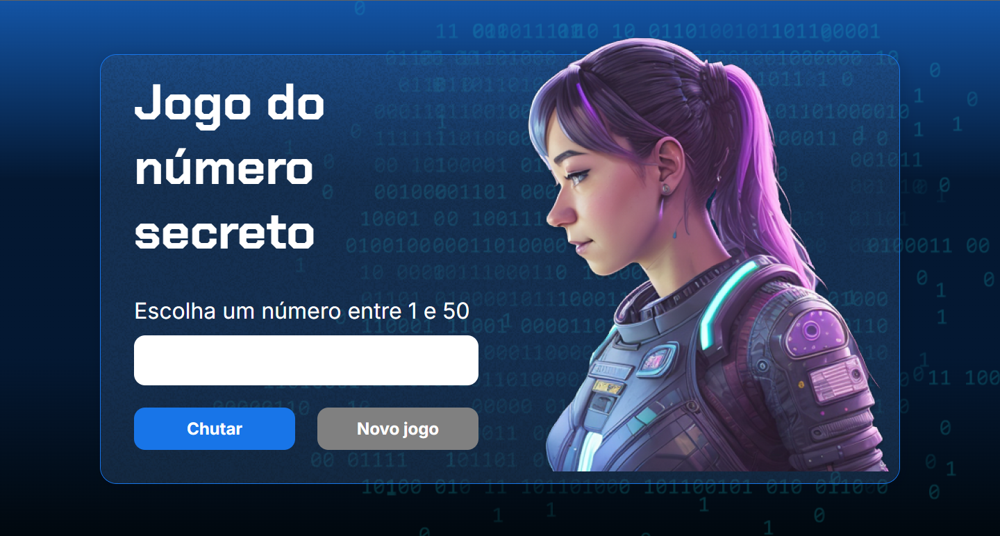

<h1>Jogo do Número Secreto by Alura</h1>
<h2>Primeiro projeto realizado com as aulas da alura</h2>
 

<h2>TECNOLOGIAS USADAS</h2>
<table style="border-collapse: collapse; margin: 0 auto;">
    <tr>
        <td style="border: none; text-align: center;">
            
        </td>
        <td style="border: none; text-align: center;">
            
        </td>
        <td style="border: none; text-align: center;">
            
        </td>
    </tr>
</table>

 O intuito do projeto foi criar um pequeno site onde exista um jogo para advinhação de um número secreto

 Esse número por sua vez se altera a cada vez que o jogador acerta, além de ter a leitura em voz realizada por uma IA dos textos presentes no jogo

<h2>Print da Prévia do jogo completo</h2>

<h2> O jogo também pode ser acessado in live no link: https://jogodonumerosecreto-eight-phi.vercel.app</h2>
